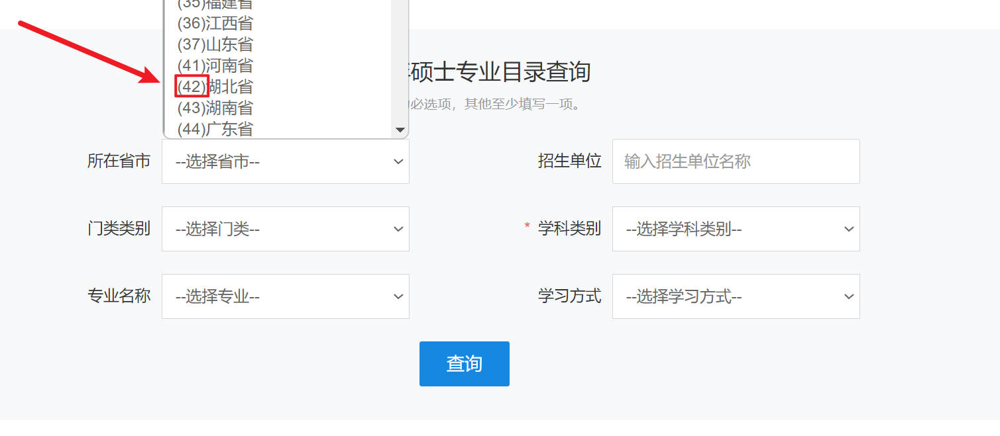

# ssml(硕士目录)
    获取研招网硕士目录信息，存储到本地，有利于考研党对各大院校进行深入分析

### 为什么写这个代码
    本人大三党，考研准备阶段，翻看这目录总是跳来跳去的看
    极其不利于比对信息。最后想选择一劳永逸，用点学到的皮毛写了个爬虫
    同时也方便更多的人使用。

### 代码效果
    按指定的规则，将硕士专业目录的信息下载到本地excel中
    可更加直观对比不同院校招生条件，考试范围，招生人数等.

### config配置：
    在运行前，配置好config里面的参数：
    data={
            'ssdm': '',  # 省市
            'dwmc': '',  # 招生单位
            'mldm': '07',  # 门类（必填）
            'mlmc': '',  #
            'yjxkdm': '0775',  # 学科类别（必填）
            'zymc': '',  # 专业名称
            'xxfs': '',  # 全日制 1/非全日制 2
        }  
    

链接直达：[硕士目录](https://yz.chsi.com.cn/zsml/zyfx_search.jsp)

    1.填写对应省市前面的数字代码
    2."门类"和"学科类别"也是同样的道理招生单位直接填学校名就可以
    3.学科类别的参数必须有，其他的随意
    4.xxfs 全日制填1，非全日制填2
    
### 运行
    有py环境，安装好依赖库，填好config的参数，就可以直接运行main.py
    save函数可以传入自定义的excel表格文件名。

### 其他
    该代码硕士研究生目录，至于博士目录，还有院校库，原理差不多
    有需要的可以克隆代码到本地，改一改get的网址和data参数，微调解析函数就欧克

## 希望自己和大家都成功上岸！